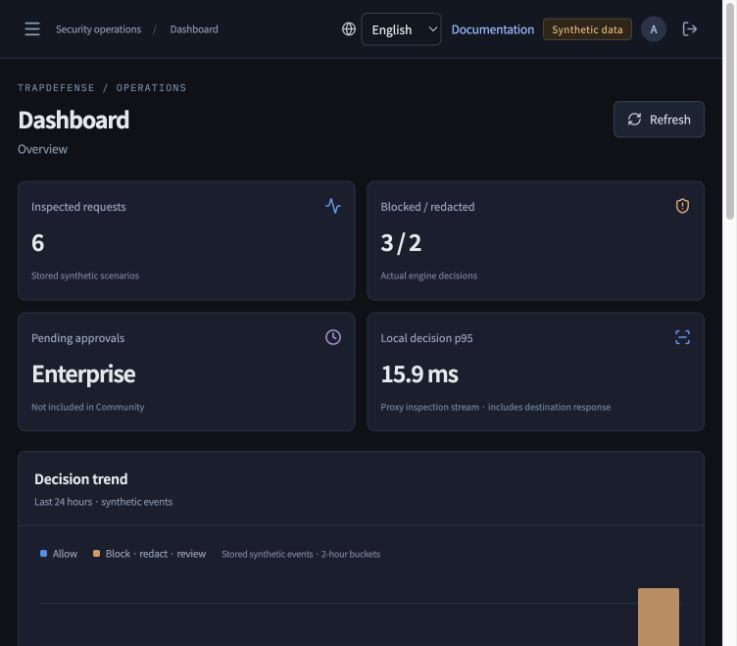
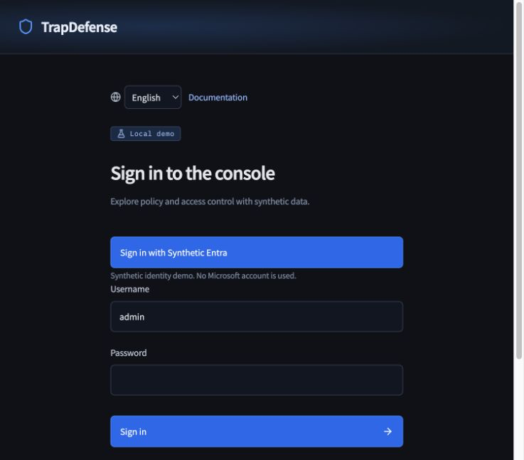

# TrapDefense — AI Firewall for Agents

[](https://github.com/hellocosmos/ai-firewall/actions/workflows/test.yml)
[](LICENSE)
[](pyproject.toml)
[](docs/en/editions.md)

[English](README.md) · [한국어](README.ko.md) · [简体中文](README.zh-CN.md) · [日本語](README.ja.md) · [Español](README.es.md) · [Français](README.fr.md)

> **Community Preview:** suitable for local evaluation and integration work. Production traffic, HA, capacity and customer identity paths require separate validation.

**Control the path from prompt to action.**

TrapDefense Community is a self-hosted AI Firewall with a local operations UI. Inspect supported HTTP and MCP tool calls, enforce action policy, redact sensitive data and keep decision evidence. The earlier SDK remains in [agent-runtime-security](https://github.com/hellocosmos/agent-runtime-security).

```text
AI agents → TrapDefense AI Firewall → Tools / MCP servers / APIs
            Action policy · Data protection · Audit
          ← Inspected responses ←
```

Logical product flow. See [deployment architecture](docs/en/architecture.md) for trusted forwarding, transport visibility and routing requirements.

Community includes single-tenant Microsoft Entra ID console SSO with Administrator and Viewer roles. Console authentication does not authorize agent actions; delegation and approval remain Enterprise features. [Entra SSO](docs/en/identity.md).

## Deployment fit and availability

Protect the HTTP API and remote MCP calls you can route through a supported inspection path. Keep existing service authentication in your MCP servers and connectors; do not replace your IAM.

Self-hosted Community is available as a source-based preview with Docker-backed proxy examples. A unified Docker installation package is planned. TrapDefense Cloud is planned, not available for sign-up: the intended managed offering uses the same inspection foundation.

[Delivery and compatibility](docs/en/deployment-fit.md)

## Why TrapDefense

TrapDefense governs the point where model output becomes a real action. It combines a proxy-based enforcement boundary with local data protection and explicit identity semantics.

| Boundary | What TrapDefense makes explicit |
|---|---|
| **Independent enforcement point** | Supported HTTP and MCP calls traverse Envoy and the inspector before reaching a configured destination. Applications do not need to embed the earlier SDK. Deployment routing must prevent bypass. |
| **Bidirectional data control** | Complete, bounded requests and responses—including supported SSE—can be allowed, blocked or redacted using action, PII and secret policies. |
| **Explicit identity boundary** | Community Entra ID SSO authenticates the console operator. The separate Enterprise pilot evaluates authority across user, agent, delegation, task, resource and action. |
| **Honest failure semantics** | Inline inspection fails closed. Mirror records hypothetical `would_*` outcomes and never changes the original traffic or approval state. |
| **Operational evidence** | The local console exposes decisions, policy coverage, destination receipts and sanitized evidence without copying protected content into audit records. |

## See it in action

<table>
  <tr>
    <td width="58%"></td>
    <td width="42%"></td>
  </tr>
  <tr>
    <td><strong>Runtime decisions</strong><br>Sanitized synthetic evidence for allow, block and redact outcomes.</td>
    <td><strong>Console identity</strong><br>Local sign-in and a protocol-realistic synthetic Entra flow.</td>
  </tr>
</table>

Screens show the local synthetic demo. They are not evidence of a production Entra tenant or customer traffic deployment.

## 5-minute local evaluation

Requires Python 3.11+, Node.js 22.12+ (or 24), npm and local Docker Engine/Desktop. Source installation; no PyPI release is implied.

```bash
git clone https://github.com/hellocosmos/ai-firewall.git
cd ai-firewall
./scripts/install-console.sh
./scripts/run-console.sh
```

Open [http://127.0.0.1:5176](http://127.0.0.1:5176). Sign in with `admin` / `1234`, then change the password in Settings. English is the default. Use the language selector before or after login; the browser remembers your choice.

Success means **Connections / System** reports the proxy, inspector and destination ready, and **Read business notes** produces HTTP 200 with a destination receipt. The initial password is only for the loopback demo; change it immediately. This flow does not configure an Internet-facing service, production routing or a real business destination.

## What you can operate

Dashboard and request evidence; local allow/block policy; global, route and tool PII policy with Mirror `would_*` assessment; synthetic HTTP scenarios; audit; password change; interface inventory, listener/upstream settings and verified apply/rollback of the owned Envoy container.

The synthetic requests traverse a real Envoy → gRPC inspector → HTTP destination path. The console records downstream receipts and response redaction; it does not substitute a direct engine call. The default listener is `127.0.0.1:18082`; the inspector uses `18101–18104` and the synthetic destination `18090`.

## Scope and editions

Community includes local policy, explicit HTTP/MCP mappings, trusted-hop signatures, bounded response/SSE inspection and sanitized local evidence. The Enterprise Access Broker is a separately distributed private pilot; Community console SSO does not confer agent identity, delegated access or approvals.

NIC inventory and topology explanation are included. The loopback demo does not configure OS addresses, two-NIC routing, transparent bridges or physical egress. Inline inspection failures block. Console Mirror observes its synchronous path; the separate mirror collector cannot block original traffic.

## Local performance baseline

Stop the console, then run a repeatable sequential baseline through the same Envoy → gRPC inspector → synthetic HTTP path:

```bash
.venv/bin/trapdefense-benchmark --scenario read --iterations 30
```

The JSON report includes p50/p95 round-trip latency, outcome counts and host characteristics. It is a local regression baseline, not a production throughput or capacity claim. See [Benchmarking](docs/en/benchmark.md).

## Documentation and verification

[Console guide](docs/en/console.md) · [Architecture](docs/en/architecture.md) · [Community / Enterprise](docs/en/editions.md) · [Benchmarking](docs/en/benchmark.md) · [SDK → Proxy](docs/en/migration.md) · [Security](docs/en/security.md) · [Contributing](CONTRIBUTING.md) · [Changelog](CHANGELOG.md)

English application source and six complete UI dictionaries are maintained together. Offline PII inspection covers explicit English, Korean, Simplified Chinese, Japanese, Spanish and French patterns and validators. It does not provide general name, location or address NER. Localized guides have a language switch at the top.

Deterministic secret inspection blocks recognized provider tokens, signed JWTs, Azure Storage SAS links and high-entropy credentials in sensitive fields across supported bodies, responses and SSE. Request credential headers remain bound to the attested mapped destination and are excluded from audit evidence. See [Security](docs/en/security.md) for exact coverage and limitations.

```bash
.venv/bin/python -m pytest -q
npm run check --prefix console
npm run build --prefix console
# Stop the running console before this Docker test.
TD_CONSOLE_E2E=1 .venv/bin/python -m pytest tests/test_console.py -q
```

These are synthetic local checks, not certification of customer TLS/IdP integration, production enforced routing, HA or performance. Detection has false positives/negatives; local audit is not immutable.

## License

MIT for Community. Private Enterprise code and customer assets are not included.


## Same-host operations (0.34)

Operate 1, 2 or 4 inspector processes from the console, view recovery state, and install an opt-in Linux user service. Same-host recovery is not cross-server HA.

[Operations](docs/en/operations.md) · [Inspector pool](docs/en/inspector-pool.md)

## Real MCP pilot (0.35 Community Preview)

Run actual MCP initialization, discovery and document tools through the firewall; optionally add a local LLM agent. Synthetic data, explicit detection limits and measured direct/proxy latency.

[MCP pilot](docs/en/mcp-pilot.md)
